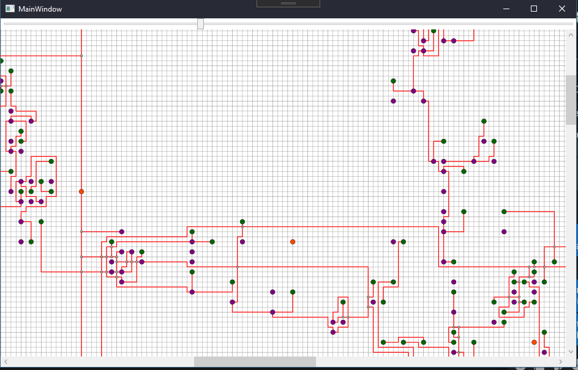
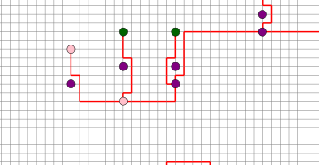
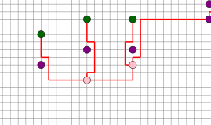

# RG_PSI_PZ2

RG_PSI_PZ2 is a school project, built using WPF.

## Getting Started

Use these instructions to get the project up and running.

### Prerequisites

You will need the following tools:

- [Visual Studio 2017-2019](https://www.visualstudio.com/downloads/)
- [.NET Framework (>=4.6.1)](https://dotnet.microsoft.com/download/dotnet-framework)

> You also need to have C# version enabled which supports `?.` and `??` operators. (Recommended version is C# 7).

### Setup

Follow these steps to get your development environment set up:

  1. Clone the repository
  1. Build solution in Visual Studio (2017 or 2019)
  1. Start Application

## Algorithm

1. Loads entitites from `Geographic.xml` (*located in `RG_PSI_PZ2/bin/Debug` folder*) and stores it to adequate position inside `GridMap` class
1. Extends `GridMap` so that each entity has empty cell around them.
1. Connects entitites for each loaded `LineEntity` using `BFS` algorithm (implemented using directional vectors - more on that can be found [here](https://youtu.be/KiCBXu4P-2Y))
    1. Barricade is cell and previous path
    1. If no path can be found then barricade is only cell (previous path is ommited) - creates crossed / shared lines
1. Draws entities and calculated paths/lines with their attached event handler

> Approximate execution time of entire algorithm is around 10 seconds, and 300mb max RAM usage

## Usage

User can zoom-in and out of grid with Scale widget, and moved around with horizontal and vertical scroll barrs.

User can also `Left click` on ellipse to zoom the screen towards it, as well as `Right click` on part of line to highlight nodes that share that part of line.

---

Copyright 2020 © [DaniloNovakovic](https://github.com/DaniloNovakovic)